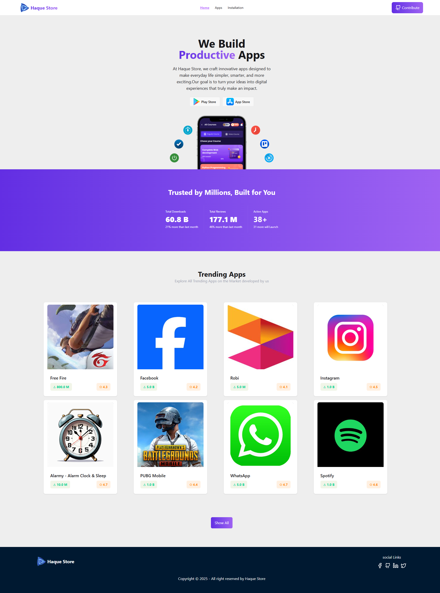
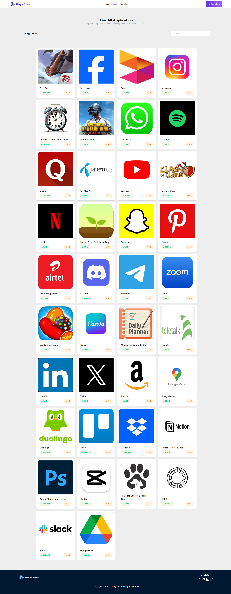
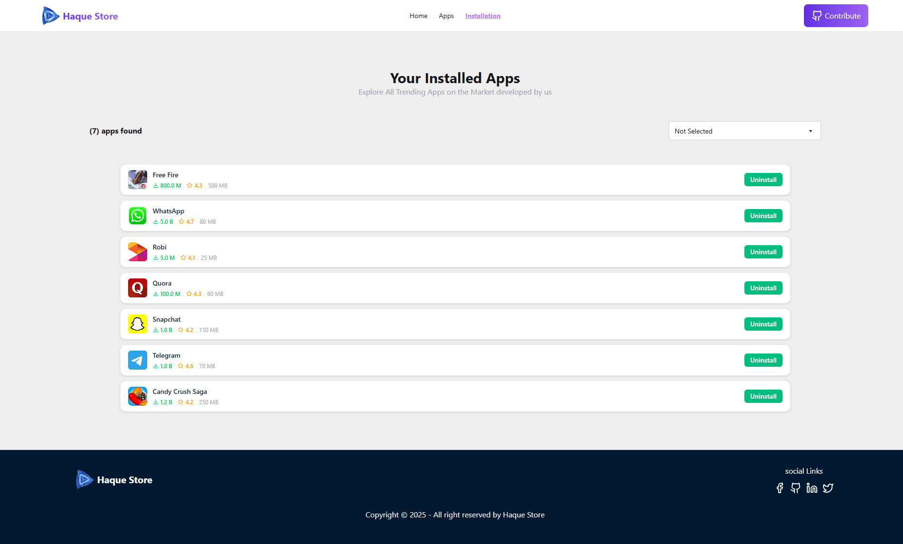
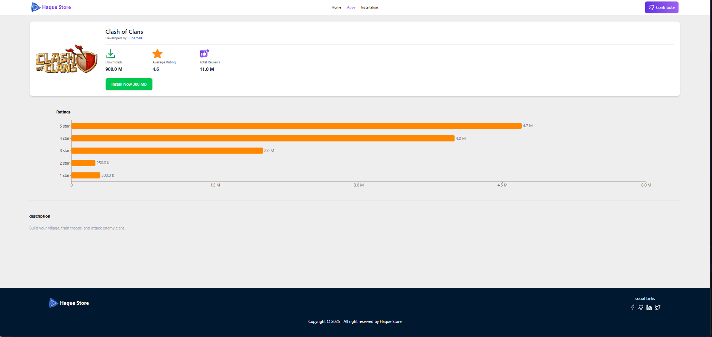

# 🌐 Haque Store — Assignment 8

### 📝 Project Summary
**Haque Store** is a fully responsive **React-based Play Store–like web application** where users can browse multiple apps, view detailed app information, install or uninstall apps, and experience smooth animations with a clean UI.

---
## 📸 Preview

---

## 🚀 Features

### 🏠 1. Home Page
- Includes a **responsive Navbar** for smooth page navigation.  
- A **Hero Section** showcasing project highlights and purpose.  
- Displays **Trending Apps** dynamically.  
- Ends with a **modern Footer** section.  

---

### 📱 2. Apps Page
- Displays all available apps using responsive **card layouts**.  
- Each app card contains:
  - App Image  
  - App Title  
  - Total Downloads  
  - Rating Information  
- Clicking a card navigates to the **App Info Page** using React Router.

---

### ℹ️ 3. App Info Page
- Shows **complete app details**, including:
  - Total Downloads  
  - Average Rating  
  - Rating breakdown using a **Bar Chart** visualization.  
- Includes an **Install Now** button that:
  - Installs the app  
  - Shows a success toast notification  
- Displays a detailed **App Description**.

---

### ⚙️ 4. Installation Page
- Displays all **installed apps** in a responsive grid layout.  
- Users can:
  - **Sort apps** by total downloads  
  - **Uninstall apps** using a button  
  - Experience an **uninstall animation** and **toast notification** after removing an app.

---

## 💻 Tech Stack

| Technology | Purpose |
|-------------|----------|
| **React.js** | Frontend Framework |
| **Tailwind CSS** | Styling & Responsiveness |
| **DaisyUI** | Pre-styled Components |
| **JavaScript (ES6+)** | Logic & Functionality |
| **HTML5 / CSS3** | Base Structure |
| **React Router** | Navigation |
| **React Toastify** | Notifications |

---

## 🧩 Key Highlights
- ⚡ **Built with React Functional Components**  
- 🎨 **Fully Responsive Design (Mobile, Tablet, Desktop)**  
- 🧭 **Smooth Navigation with React Router**  
- 🔔 **Interactive Toast Notifications**  
- 📊 **Dynamic Charts and Data Visualization**  
- 🧠 **Reusable Component Architecture**

---

## 🗂️ Version Control
- Managed using **Git & GitHub** for collaboration and version history.

---

## ☁️ Deployment
- Hosted on **Cloudflare Pages** for fast global access and performance.

---

## 🧑‍💻 Author
**Developed by [Ekramul Haque](https://github.com/ekram-haque)**  
Frontend Developer | React Enthusiast | Lifelong Learner 🚀

---

